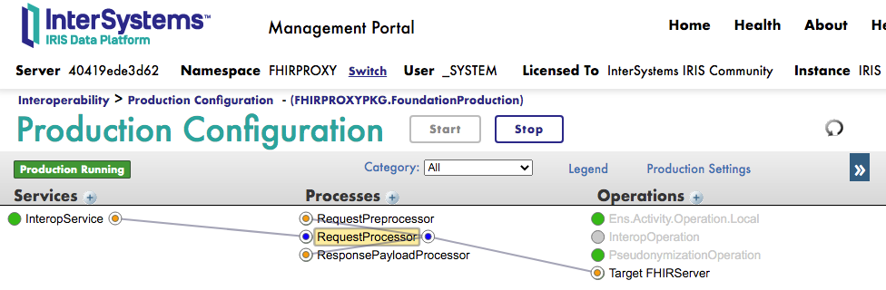
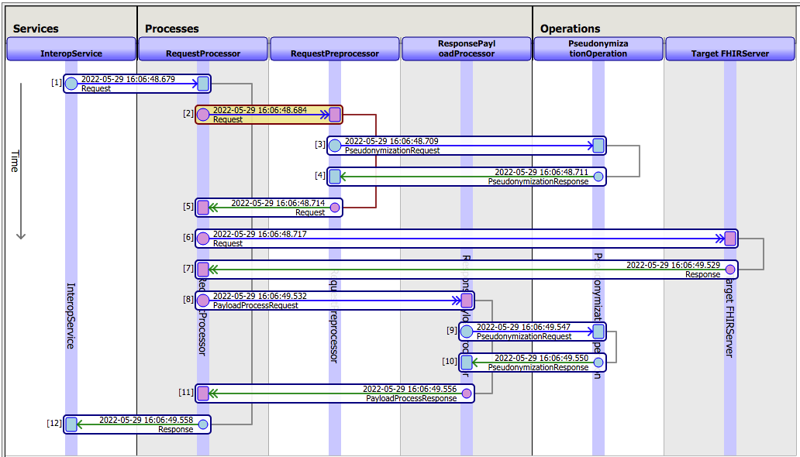
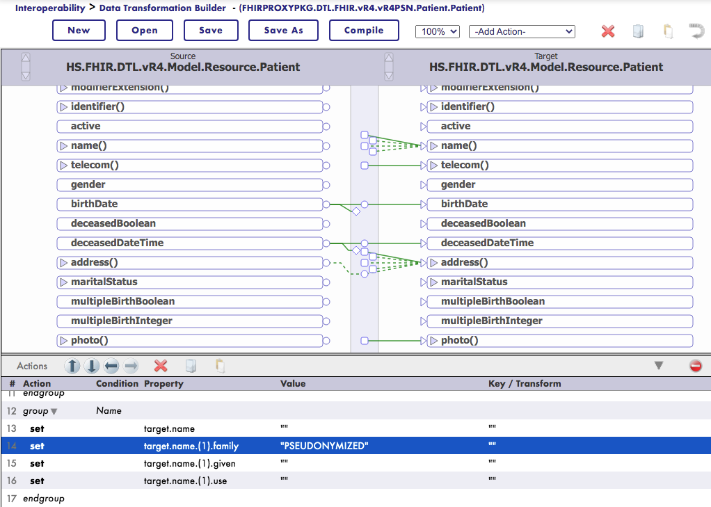

# FHIR Pseudonymization Proxy

[](https://openexchange.intersystems.com/package/git-for-iris)
[](https://github.com/MW-de/git-for-iris)
[](https://www.intersystems.com/products/intersystems-iris/)
[](https://opensource.org/licenses/MIT)

**FHIR Pseudonymization Proxy** is an IRIS for Health application which acts as a REST API proxy to a FHIR server. It realizes **on-the-fly pseudonymization** of incoming GET requests and outgoing responses (FHIR resources) and can be used to transparently retrieve pseudonymized data from a FHIR server which holds sensitive data.

The pseudonymization is fully customizable via DTLs.

## Installation

- Clone repo, build and run the docker image from a terminal window:
```
git clone https://github.com/MW-de/fhir-pseudonymization-proxy.git
cd fhir-pseudonymization-proxy
./docker-build.sh
docker-compose up -d
```

## Usage

- The FHIR proxy endpoint is `http://localhost:9092/fhirproxy/r4`. It can be used for `GET` requests like a regular FHIR server.

- *(Optional)* Production settings can be adjusted in the **Management Portal** in http://localhost:9092/csp/sys/UtilHome.csp (Login with `_system:SYS`) in namespace **FHIRPROXY**, e. g. to define a different target FHIR server (other than the built-in at `/fhirrepo/r4`).

### Example FHIR REST requests

Base URL = `http://localhost:9092/fhirproxy/r4`.

```js
// Querying the FHIR proxy returns a Bundle of Patients with on-the-fly pseudonymized IDs and data
GET http://localhost:9092/fhirproxy/r4/Patient

// Compare with the original data by querying the target FHIR server directly
GET http://localhost:9092/fhirrepo/r4/Patient
```

After initial retrieval via FHIR query, the pseudonyms can be used for subsequent queries:

```js
// search a Patient resource by its pseudonymized ID
GET /Patient?_id=PSN-245edc18f4ce

// get all data from a single Patient with $everything pseudonymized
GET /Patient/PSN-245edc18f4ce/$everything

// query a Patient by a pseudonymized identifier (MRN)
GET /Patient?identifier=http://hospital.smarthealthit.org|PSN-f735471e8ff9

// query a Condition for a subject by a pseudonymized reference
GET /Condition?subject=Patient/PSN-245edc18f4ce
```

The proxy translates the pseudonyms into the real value before querying the target FHIR server, completely transparent to the client.


## Architecture

The FHIR proxy is built as a modular **interoperability production** which includes the components:
- [FHIRInteroperabilityAdapter](https://docs.intersystems.com/irisforhealthlatest/csp/docbook/Doc.View.cls?KEY=HXFHIR_fhir_adapter) to expose a FHIR REST API
- **RequestProcessor**, the main business process which handles the requests
- **RequestPreprocessor**
- **ResponsePayloadProcessor**
- **PseudonymizationOperation**
- a set of DTLs, **FHIRPROXYPKG.DTL.FHIR.*** which perform the actual pseudonymization

Production overview:



Requests are intercepted through the **RequestPreprocessor** and then forwarded to the target FHIR server. The reponse is intercepted through the **ResponsePayloadProcessor** and the transmitted back to the client:



The pseudonymization is realized through a set of DTLs which define the rules according to which the data shall be pseudonymized:



The **PseudonymizationOperation** is invoked from within the DTLs and translates values into pseudonyms:


## Pseudonymization 

### Response pseudonymzation

#### ID pseudonymization

ID pseudonymization includes resource IDs and identifiers:

- FHIR resource IDs
  - `[Resource].id`
- FHIR references
  - `[Resource].subject`
  - (...)
- identifiers
  - `[Resource].identifier`

In this example application, ID pseudonymization is implemented in the **PseudonymizationOperation** via hashing. **PseudonymizationOperation** persists all created pseudonyms in the global `^PseudonymD` for reverse lookup of hashed values.

**Note:** In real-world applications, ID pseudonymization will likely be carried out by a more sophisticated method, or an external system which the PseudonymizationOperation will dispatch the pseudonymization requests to.


#### Data pseudonymization

Data pseudonymization may be adjusted according to the requirements of the application by customizing the DTLs. The following elements are implemented as a starting point:

- `Patient.name`: replaced by "PSEUDONYMIZED"
- `Patient.birthDate`: set to the 15th of the month
- `Patient.address`: removed except for the first 3 digits of the postal code
- `Patient.telecom`, `Patient.contact`, `Patient.photo`, `Patient.generalPractitioner`: removed
- `Pracitioner.name`: replaced by "PSEUDONYMIZED"
- (more, see DTLs for details)

**Note:** Data contained in extensions is currently not pseudonymized.


### Request pseudonymzation

**ids** and **identifiers** which are part of the request, e. g. in `GET /Patient?identifier=[MRN]`, need to be converted to their correct pseudonyms before dispatching the request to the target FHIR server to
- a) provide consistent FHIR retrieval and search capabilities and
- b) avoid leakage of real identifier <> pseudonym pairs, i. e. `GET /Patient/[RealID]` shall not return the data for `GET /Patient/[PSN]`.

Currently, these query formats are implemented:
- `GET /[Resource]/[id]` -> `GET /[Resource]/[PSN]`
- `GET /[Resource]?_id=[id]` -> `GET /[Resource]?_id=[PSN]`
- `GET /[...]?subject=[Resource]/[id]` -> `GET /[...]?subject=[Resource]/[PSN]`
- `GET /[Resource]?identifier=system|[value]` -> `GET /[Resource]?identifier=system|[PSN]`
- translation of `Bundle.link` URLs to proxied URLs

**Note:** Implementing the entire FHIR search capabilities is more complex and not yet part of this proof-of-concept.

## Change log

### v0.1.0

- Initial release in a working proof-of-concept state


## Acknowledgement

This project uses parts from [iris-fhir-template](https://openexchange.intersystems.com/package/iris-fhir-template) by Evgeny Shvarov.
